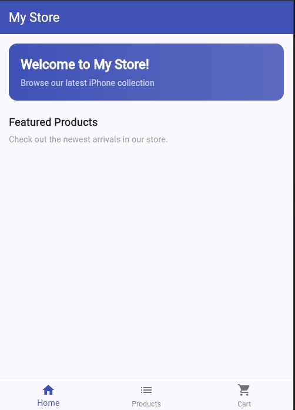
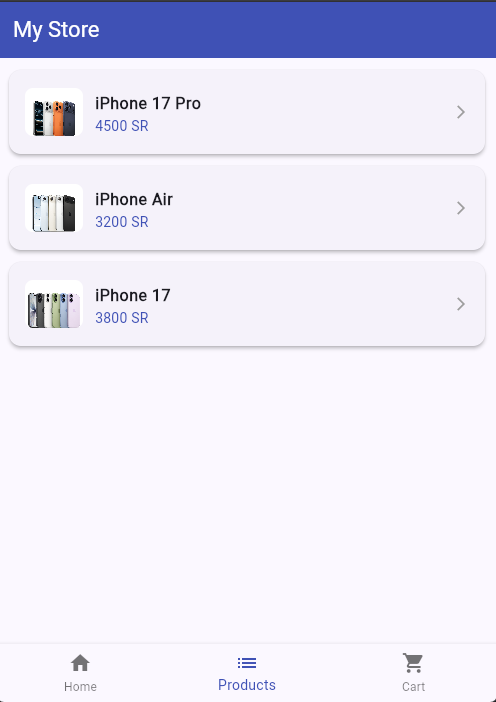
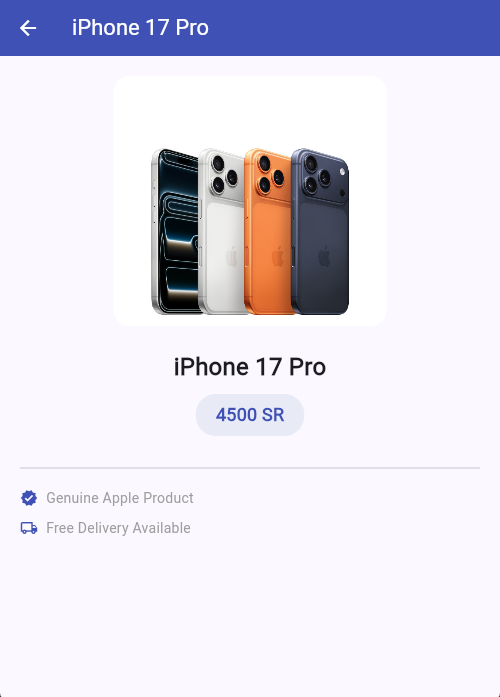
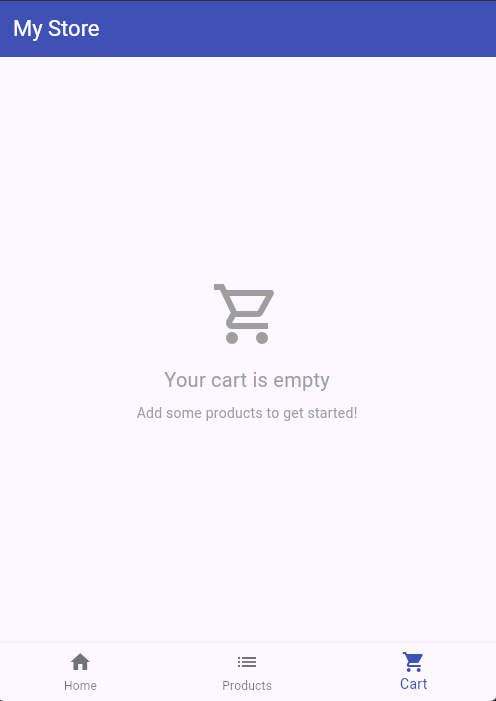

# My Store — Flutter Shopping App

A simple mobile shopping app built with Flutter as a university lab project. It displays a list of products and allows users to browse product details through a clean, multi-page interface.

---

## Features

- Bottom navigation bar with Home, Products, and Cart tabs
- Product list with card-style UI (image, name, price)
- Product detail page with image, price badge, and delivery info
- Empty cart placeholder screen
- Welcome banner on the home page
- Indigo color theme throughout

---

## Screenshot






---

## Getting Started

**1. Install dependencies**

```bash
flutter pub get
```

**2. Run the app**

```bash
flutter run
```

---

## Tech Stack

| Tool    | Version |
| ------- | ------- |
| Flutter | 3.x     |
| Dart    | 3.x     |

---

## Project Structure

```
lib/
└── main.dart       # All pages and widgets
assets/
├── iPhone_17_Pro.jpeg
├── iPhone_air.jpeg
└── iPhone_17.jpeg
```

---

## Author

Built as part of a mobile development lab assignment.
