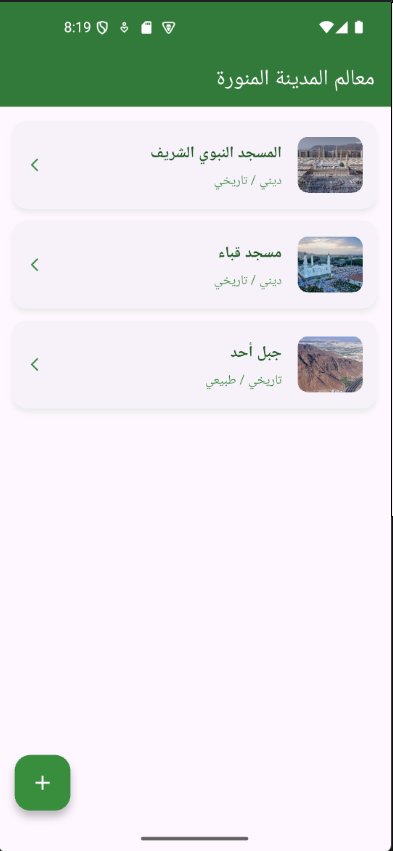
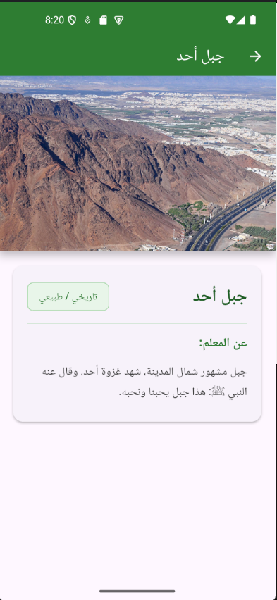
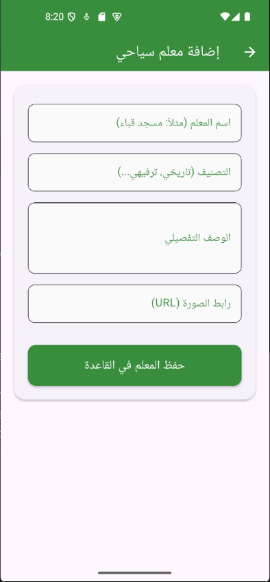

# Landmarks of Al-Madinah Al-Munawwarah

A Flutter mobile app for browsing and adding tourist landmarks in Al-Madinah Al-Munawwarah. The app connects directly to a MySQL database and displays landmarks with images, categories, and detailed descriptions.

---

## Screenshots

|        Landmarks List         |          Landmark Details           |           Add Landmark            |
| :---------------------------: | :---------------------------------: | :-------------------------------: |
|  |  |  |

---

## Features

- Browse all landmarks in a clean list with thumbnail images
- Tap any landmark to view its full details and description
- Add new landmarks with name, category, description, and image URL
- RTL (right-to-left) Arabic interface
- Direct MySQL database connection (no backend server needed)

---

## Connecting Your MySQL Database

Open `lib/database_service.dart` and update these fields:

```dart
final String host = '10.0.2.2';      // Your MySQL host (10.0.2.2 = localhost for Android emulator)
final int port = 3306;               // MySQL port (default: 3306)
final String userName = 'root';      // Your MySQL username
final String password = '';          // Your MySQL password
final String databaseName = 'landmarks_db';  // Your database name
```

Your `landmarks` table should have these columns:

```sql
CREATE TABLE landmarks (
  id INT AUTO_INCREMENT PRIMARY KEY,
  name VARCHAR(255),
  category VARCHAR(100),
  description TEXT,
  image_url TEXT
);
```

> **Note:** If running on a physical device, replace `10.0.2.2` with your machine's local IP address (e.g. `192.168.1.x`).

---

## Image URLs

This app uses direct image URLs to display landmark photos.

**Recommended:** Upload your images to [postimages.org](https://postimages.org), then copy the **Direct link** (ends with `.jpg` or `.png`). Paste it into the image URL field when adding a landmark.

---

## How to Run

```bash
flutter pub get
flutter run
```

Make sure your MySQL server is running and accessible before launching the app.

---

## Tech Used

- **Flutter** — UI framework
- **Dart** — Programming language
- **MySQL** — Database (`mysql_client` package)
