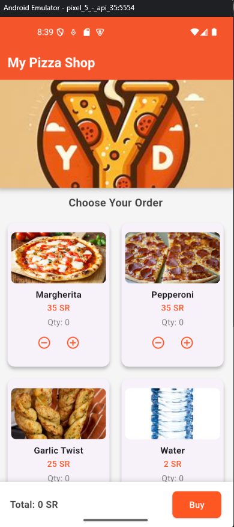
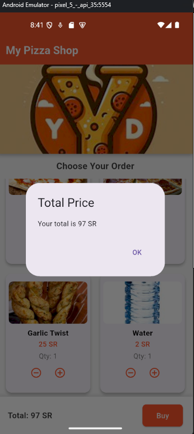
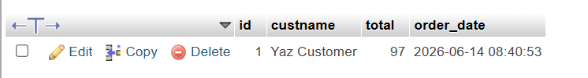
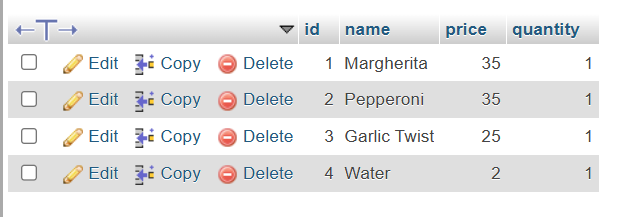

# My Pizza Shop

A simple Flutter app that lets users browse a pizza menu, select item quantities, and place an order that gets saved to a MySQL database.

## Features

- Browse menu items (pizzas, sides, drinks) in a grid layout
- Increase or decrease quantity for each item
- See the total price update as you add items
- Place an order — saves to `orders` and `purchases` tables in MySQL
- Clean and simple UI

## Screenshots

| Home Screen                   | Order Placed                    | Orders DB                            | Purchases DB                               |
| ----------------------------- | ------------------------------- | ------------------------------------ | ------------------------------------------ |
|  |  |  |  |

## How to Connect Your Own MySQL Database

Open `lib/database_service.dart` and update the connection fields at the top of the class:

```dart
final String host = '10.0.2.2';         // Your MySQL server IP (10.0.2.2 = localhost on Android emulator)
final int port = 3306;                   // MySQL port (default: 3306)
final String userName = 'root';          // Your MySQL username
final String password = '';              // Your MySQL password
final String databaseName = 'pizza_db'; // Your database name
```

Make sure your MySQL server is running and the required tables exist:

```sql
CREATE TABLE orders (
  id INT AUTO_INCREMENT PRIMARY KEY,
  custname VARCHAR(100),
  total INT,
  order_date DATETIME
);

CREATE TABLE purchases (
  id INT AUTO_INCREMENT PRIMARY KEY,
  name VARCHAR(100),
  price INT,
  quantity INT
);
```

## How to Run

```bash
flutter pub get
flutter run
```

## Tech Used

- **Flutter** — UI framework
- **Dart** — Programming language
- **MySQL** — Database (via `mysql_client` package)
