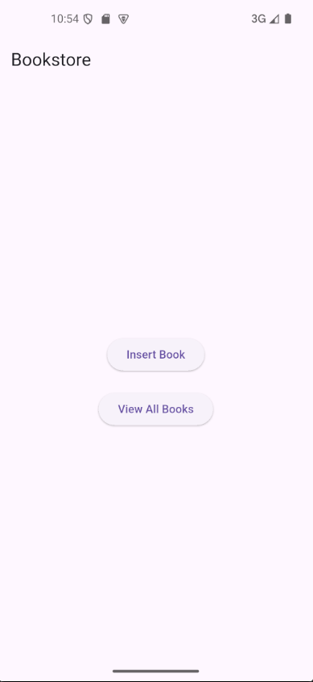
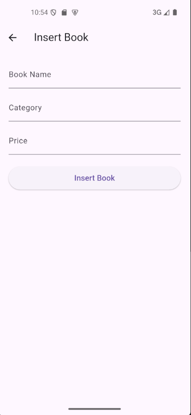
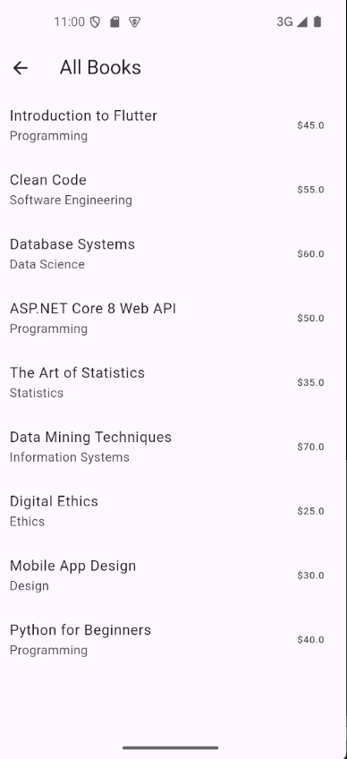

# Bookstore App — Lab 8 & 9

A Flutter mobile app connected to an ASP.NET Core Web API for managing a list of books (add and view).

---

## Requirements

- [Flutter SDK](https://flutter.dev/docs/get-started/install)
- [.NET 8 SDK](https://dotnet.microsoft.com/download)
- SQL Server LocalDB (comes with Visual Studio)

---

## Running the API

1. Open the `lab_8_9_api` folder in Visual Studio
2. Open the `.sln` solution file
3. Press **Run** or **F5**
4. Swagger will open automatically in the browser
5. The API runs on port `5035`

---

## Running the Flutter App

1. Open the `lab_8_9` folder in VS Code or Android Studio
2. Run in the terminal:
   ```
   flutter pub get
   ```
3. Start an Android emulator
4. Press **Run** or execute:
   ```
   flutter run
   ```

---

## Important Note

The database file `lab_8_9.mdf` is already included in the project.  
**No database setup or migrations needed — just run the API and it connects automatically.**

---

## Screenshots

| Home Page | Add Book | View Books |
|:-:|:-:|:-:|
|  |  |  |
